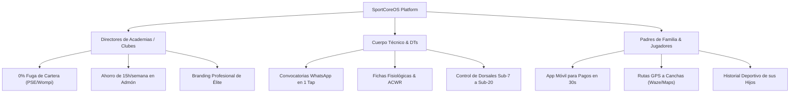

# 🏆 SportCoreOS — Marketing Kit & Complete Design Suite

Bienvenido al kit oficial de **Marketing, Identidad Visual, Activos Gráficos y Estrategia de Lanzamiento** para **SportCoreOS: Athletic Performance Cloud**.

---

## 📌 1. Catálogo de Activos Gráficos Oficiales

Todos los activos han sido generados en alta fidelidad y desplegados en las carpetas de producción del proyecto (`SportCoreOS/branding/`, `SportCoreOS-web/src/assets/branding/`, `SportCoreOS-mobile/src/assets/branding/` y `public/`):

| Activo | Formato / Ratio | Dimensiones / Specs | Ubicación del Archivo | Propósito de Uso |
| :--- | :---: | :---: | :--- | :--- |
| **Logotipo Insignia (Full Badge)** | `JPG` / `1:1` | `1024 x 1024 px` | `branding/sportcore_logo.jpg` | Emblema oficial, encabezados institucionales, credenciales y papelería. |
| **Isotipo / Glifo Central** | `JPG` / `1:1` | `1024 x 1024 px` | `branding/sportcore_icon.jpg` | Avatar de perfil, marcas de agua, botones de menú y logos compactos. |
| **Ícono App Móvil (Squircle)** | `JPG` / `1:1` | `1024 x 1024 px` | `branding/sportcore_mobile_icon.jpg` | Apple App Store, Google Play Store, PWA Homescreen icon. |
| **Splash Screen Cinemático** | `JPG` / `9:16` | `1080 x 1920 px` | `branding/sportcore_splashscreen.jpg` | Pantalla de carga y bienvenida en Apps móviles (iOS/Android) y PWA. |
| **Banner de Marketing & Hero** | `JPG` / `16:9` | `1920 x 1080 px` | `branding/sportcore_marketing_banner.jpg` | OpenGraph (WhatsApp/LinkedIn), Google Play Feature Graphic, Web Hero. |
| **Post Anuncio Redes Sociales** | `JPG` / `1:1` | `1080 x 1080 px` | `branding/sportcore_social_post.jpg` | Publicaciones en Instagram, Facebook, banners de display y anuncios. |
| **Favicon Vectorial Escalable** | `SVG` | Vectorial (`512x512`) | `branding/sportcore_favicon.svg` | Favicon para navegadores web (`favicon.svg`), bookmarks y tabs. |
| **Web Manifest PWA** | `JSON` | Configuración PWA | `public/manifest.webmanifest` | Instalabilidad PWA para Android, iOS, Windows y macOS. |

---

## 🚀 2. Propuesta de Valor & Argumentarios de Venta (Pitch Playbook)

### ⚡ One-Liner Oficial
> *"SportCoreOS: El sistema operativo en la nube que transforma academias de fútbol en canteras de alto rendimiento mediante telemetría, recaudo digital y gestión 360°."*

### ⏱️ Elevator Pitch (30 Segundos)
> *"Administrar una academia de fútbol moderna no debería depender de planillas de papel, cobros manuales por transferencias perdidas ni chats caóticos de WhatsApp. SportCoreOS centraliza la cobranza de mensualidades con PSE y Wompi, despacha convocatorias a partidos en un toque por WhatsApp, gestiona expedientes biométricos 360° y visualiza telemetría GPS para proyectar a tus futuras estrellas al fútbol profesional. Menos administración, más campeones."*

---

### 🎯 Segmentación de Argumentarios B2B / B2C



#### A. Para Directores y Propietarios de Academias (Enfoque Financiero & Control)
- **Problema:** Morosidad en mensualidades, desorden en inscripciones, falta de control en categorías masivas.
- **Solución SportCoreOS:** Recaudo automatizado con pasarela de pagos colombiana (PSE, Nequi, Daviplata, Tarjetas vía Wompi/Bancolombia), reportes de conciliación en tiempo real y alertas automáticas de cartera.
- **Frase de Cierre:** *"SportCoreOS incrementa tu tasa de recaudo al 98% en los primeros 60 días."*

#### B. Para Directores Técnicos y Entrenadores (Enfoque Deportivo & Operativo)
- **Problema:** Armar listas de convocatorias manualmente, descontrol de asistencia, falta de historial médico/físico.
- **Solución SportCoreOS:** Citaciones automáticas a partidos y entrenamientos con botón de confirmación de asistencia por WhatsApp, control de minutos jugados, tarjetas, goles y expedientes antropométricos.
- **Frase de Cierre:** *"Dedica el 100% de tu tiempo a la táctica; SportCoreOS se encarga de la logística."*

#### C. Para Padres de Familia (Enfoque Confianza & Experiencia Móvil)
- **Problema:** No saber horarios exactos de canchas, comprobantes de pago extraviados, incertidumbre sobre el progreso del deportista.
- **Solución SportCoreOS:** Portal y App móvil intuitiva para pagar mensualidades en 1 clic, recibir notificaciones de convocatorias y ver cómo evoluciona su hijo en cada categoría.
- **Frase de Cierre:** *"La experiencia deportiva profesional que tu hijo merece, al alcance de tu teléfono."*

---

## 📱 3. Copys Listos para Campañas de Marketing & Redes Sociales

### 📷 Post 1: Lanzamiento Oficial (Instagram / Facebook / LinkedIn)

```text
⚽ ¡EL FUTURO DE LAS ACADEMIAS DE FÚTBOL HA LLEGADO! 🚀🔥

¿Sigues gestionando tu escuela deportiva con cuadernos, chats masivos y cobros manuales? Es momento de dar el salto al alto rendimiento con SportCoreOS.

🏆 La Suite Tecnológica Integral diseñada para canteras que forman a las futuras estrellas:
✅ Recaudo Automático de Mensualidades (PSE, Wompi, Tarjetas).
✅ Convocatorias a Partidos en 1 toque directo a WhatsApp.
✅ Expedientes Deportivos 360° (Biometría, Físico y Fichas Médicas).
✅ Telemetría GPS y Métricas Tácticas desde Sub-7 hasta Sub-20.
✅ Portal Móvil para Padres y Cuerpo Técnico.

💡 Solicita tu Demo Institucional hoy mismo y profesionaliza tu club.
👉 Conoce más en: https://sportcoreos.sectic.com
#SportCoreOS #FutbolBase #AcademiasDeFutbol #GestionDeportiva #SaaSDeportivo #Colombia #FutbolColombiano
```

---

### 💬 Post 2: Guion de Prospección Directa para WhatsApp B2B (Directores de Club)

```text
¡Hola [Nombre del Director/Profesor]! 👋⚽

Te saludo de parte de SportCoreOS by SECTIC. Hemos estado siguiendo el excelente trabajo de formación deportiva que realizan en [Nombre de la Academia].

Desarrollamos una plataforma especializada para clubes como el tuyo, que permite:
1. Eliminar la mora de mensualidades recaudando directo por PSE/Nequi/Wompi con recibos automáticos.
2. Enviar convocatorias a partidos por WhatsApp en 1 segundo con confirmación de asistencia.
3. Llevar las fichas técnicas, dorsales y progreso físico de cada categoría desde Sub-7 hasta Sub-20.

¿Te gustaría ver una demostración interactiva de 10 minutos sin compromiso para ver cómo optimizar la administración de tu club? 🚀

Quedo atento. ¡Muchos éxitos en la jornada deportiva! 🥅⚽
```

---

## 📲 4. Metadatos ASO para Tiendas de Aplicaciones (App Store & Google Play)

| Campo | Especificación / Texto |
| :--- | :--- |
| **App Title (iOS / Android)** | `SportCoreOS — Athletic Cloud` |
| **Subtitle (iOS - 30 chars)** | `Gestión para Academias de Fútbol` |
| **Short Description (Android - 80 chars)** | `El sistema integral para academias de fútbol: pagos, telemetría y convocatorias.` |
| **Category** | `Deportes (Sports)` / `Productividad (Productivity)` |
| **Content Rating** | `Para todos (Everyone / 4+)` |
| **Keywords (ASO)** | `futbol, academias de futbol, gestion deportiva, canteras, convocatorias futbol, pagos pse futbol, telemetria gps futbol, colombia, sub 15, sub 20, escuelas deportivas` |

---

## 🎨 5. Resumen de Integración Técnica en el Código

1. **Favicon Vectorial SVG y Fallbacks ICO:**
   - Vinculado en `<head>` de `SportCoreOS-web/src/index.html` y `SportCoreOS-mobile/src/index.html`.
2. **Web App Manifest:**
   - Configurado en `public/manifest.webmanifest` con soporte PWA `standalone`, colores de marca (`#0b0f19` / `#10b981`) e iconos en alta definición.
3. **OpenGraph & Twitter Cards:**
   - Meta tags dinámicos integrados con el banner `sportcore_marketing_banner.jpg` para vistas previas ricas en WhatsApp, Facebook, LinkedIn y Twitter/X.
4. **Preloading de Splash Screen:**
   - Pre-carga del asset cinemático `sportcore_splashscreen.jpg` en la aplicación móvil para transiciones fluidas sin parpadeos.

---
*SportCoreOS © 2026 SECTIC S.A.S. • Athletic Performance Cloud • Todos los derechos reservados.*
