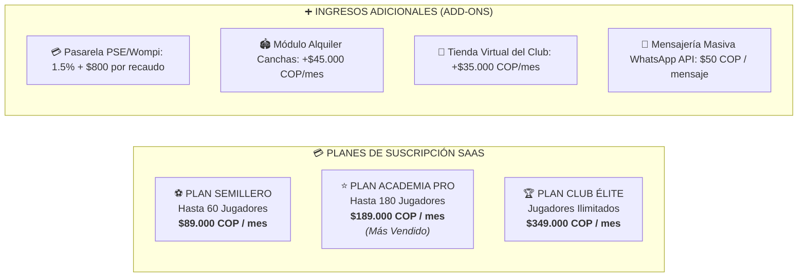
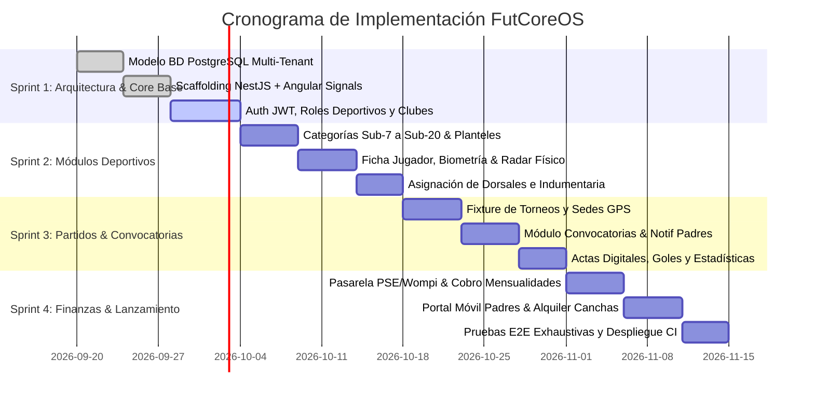
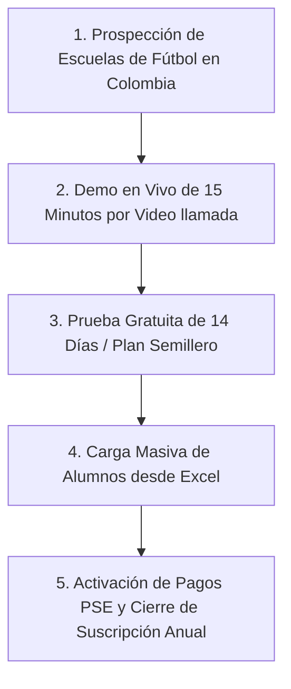

# 🏆 MASTER PLAN DE TRABAJO & ESTRATEGIA COMERCIAL: FutCoreOS
**SaaS de Gestión Integral para Escuelas, Clubes y Academias de Fútbol**  
*Desarrollado por SECTIC S.A.S.*

---

## 📌 1. RESUMEN EJECUTIVO DEL PRODUCTO

**FutCoreOS** es una plataforma SaaS Cloud + Web App Mobile-First diseñada específicamente para profesionalizar y automatizar la operación deportiva, administrativa y financiera de las escuelas y academias de fútbol formativo en Colombia y América Latina.

### 🎯 Propuesta de Valor Diferencial:
1. **Cobranzas Automatizadas PSE / Wompi / Nequi:** Reduce la morosidad histórica del 35% a menos del 8% mediante cobro recurrente y recordatorios automáticos por WhatsApp.
2. **Convocatorias Inteligentes:** Notificación instantánea a los padres de familia con hora de citación, sede GPS, rival y confirmación de asistencia en 1 clic.
3. **Ficha Deportiva & Biometría:** Historial antropométrico (peso, talla, IMC), test físicos, pierna hábil, posición táctica y boletín de evaluación técnica semestral.
4. **Control de Dorsales e Indumentaria:** Cero camisetas duplicadas en torneos oficiales y gestión de kits de entrenamiento/competencia.

---

## 💰 2. ESTRATEGIA DE PRECIOS Y PAQUETES COMERCIALES (PRICING B2B)

El modelo de monetización se basa en **Suscripción Mensual / Anual (SaaS recurrente)** segmentada por la cantidad de jugadores activos en la academia, más una **Comisión por Transacción Pasarela (Fintech)**.

### 📊 Tabla de Planes y Características

| Característica / Módulo | 🌱 Plan Semillero | ⭐ Plan Academia Pro | 🏆 Plan Club Élite |
| :--- | :---: | :---: | :---: |
| **Límite de Jugadores Activos** | Hasta 60 alumnos | Hasta 180 alumnos | **Ilimitados** |
| **Categorías Deportivas** | Hasta 4 categorías | Hasta 10 categorías | **Ilimitadas** |
| **Usuarios Entrenadores / Staff** | 3 Entrenadores | 8 Entrenadores | **Ilimitados** |
| **Fichas Deportivas & Biometría** | Básica (Peso/Talla) | Completa + Test Físicos | Completa + Radar Gráfico + Scouting |
| **Convocatorias y Partidos** | ✅ Incluido | ✅ Incluido | ✅ Incluido + Confirmación SMS |
| **Cobro PSE / Wompi / Tarjetas** | ✅ Incluido | ✅ Incluido | ✅ Incluido (Tasa preferencial) |
| **App Web para Padres de Familia** | ✅ Incluido | ✅ Incluido | ✅ Incluido (Personalizada) |
| **Control de Dorsales y Uniformes**| ❌ No incluido | ✅ Incluido | ✅ Incluido |
| **Módulo Alquiler de Canchas** | ❌ No incluido | ➕ Add-on opcional | ✅ Incluido |
| **Dominio Propio y Logo de Club** | ❌ Subdominio FutCore | ✅ Subdominio FutCore | ✅ Dominio propio (ej. academiafc.com) |
| **Soporte Técnico** | WhatsApp Horario Hábil | WhatsApp Prioritario | Gerente de Cuenta Dedicado 24/7 |
| **PRECIO MENSUAL (COP)** | **$89.000 COP** | **$189.000 COP** | **$349.000 COP** |
| **PRECIO ANUAL (Pago Anticipado)** | **$890.000 COP** *(Ahorra 2 meses)* | **$1.890.000 COP** *(Ahorra 2 meses)* | **$3.490.000 COP** *(Ahorra 2 meses)* |
| **PRECIO INTERNACIONAL (USD)** | **$25 USD / mes** | **$49 USD / mes** | **$89 USD / mes** |

---

## 🗓️ 3. PLAN DE TRABAJO (ROADMAP & SPRINTS DE DESARROLLO)

Apalancando la arquitectura ya validada de **`EduCoreOS`**, el desarrollo de **`FutCoreOS`** se ejecutará en **4 Sprints de 2 semanas (Total: 8 semanas para Lanzamiento Comercial)**.

### 📋 Detalle de Entregables por Sprint

#### 🏃 Sprint 1: Cimientos Tecnológicos & Multi-Tenant (Semanas 1-2)
- **Base de Datos:** DDL PostgreSQL con esquemas aislados por club o discriminación por `club_id` / `tenant_id`.
- **Backend NestJS:** Módulos de Autenticación JWT, guards por roles (`SUPER_ADMIN`, `DIRECTOR_CLUB`, `ENTRENADOR`, `PREPARADOR_FISICO`, `ACUDIENTE`, `JUGADOR`), CRUD de Clubes y Sedes.
- **Frontend Angular:** Layout responsive Clean Pro Sport (diseño limpio y claro por defecto con botón selector dinámico Light/Dark Mode), sidebar colapsable, selector multi-tenant de clubes, interceptor HTTP con inyección de token JWT.

#### 🏃 Sprint 2: Gestión Deportiva, Categorías y Biometría (Semanas 3-4)
- **Categorías:** Configuración de rangos de edad (Sub-7 a Sub-20), rama masculina/femenina, asignación de cuerpo técnico.
- **Jugadores:** Registro con foto, datos de acudiente, póliza de seguro, posición táctica y pierna hábil.
- **Biometría:** Registro periódico de antropometría (peso, talla, IMC, envergadura) y tests de condición física (Cooper, velocidad 30m, salto vertical) con gráficos de evolución temporal.
- **Dorsales:** Matriz visual de camisetas ocupadas y disponibles por categoría.

#### 🏃 Sprint 3: Partidos, Convocatorias y Estadísticas (Semanas 5-6)
- **Fixture y Calendario:** Programación de partidos amistosos y de liga, rivales, canchas con enlace Google Maps / Waze.
- **Convocatorias:** Selección de nómina titular, suplentes y no convocados. Notificación instantánea a padres.
- **Actas de Partido en Vivo:** Registro digital de goles, asistencias, tarjetas amarillas/rojas, sustituciones y elección del MVP.
- **Tablas de Rendimiento:** Goleadores, vallas menos vencidas, minutos jugados por jugador.

#### 🏃 Sprint 4: Finanzas PSE, Portal de Padres y Lanzamiento (Semanas 7-8)
- **Motor Financiero:** Generación automática de cargos mensuales (pensiones), cobro de arbitrajes, inscripciones a torneos y uniformes.
- **Pasarela de Pagos:** Integración con Wompi / PSE para pago inmediato con tarjeta débito/crédito y Nequi.
- **Portal Padres:** Web app optimizada para celular donde el acudiente revisa la citación al partido, paga la pensión y descarga el boletín deportivo.
- **Testing & Despliegue:** Suite de pruebas E2E con Playwright bajo la regla de Error Sniffer Estricto.

---

## 🎯 4. ESTRATEGIA GO-TO-MARKET Y ADQUISICIÓN DE CLIENTES EN COLOMBIA

1. **Canal Directo (Outbound B2B):** Base de datos de más de 1.200 escuelas de fútbol registradas en Difútbol, Liga de Bogotá, Liga Antioqueña, Liga del Valle, Liga del Atlántico y torneos como PonyFútbol / BabyFútbol.
2. **Gancho de Venta Irresistible:** *"Te garantizamos reducir en un 70% los padres morosos en el primer mes o te devolvemos tu dinero."*
3. **Migración Gratuita:** El equipo de SECTICS sube la base de datos de jugadores desde el Excel desordenado de la escuela en menos de 2 horas.
4. **Convenios con Ligas Departamentales:** Ofrecer a las ligas un panel de supervisión gratuito si exigen a sus clubes afiliados el uso de la plataforma.
